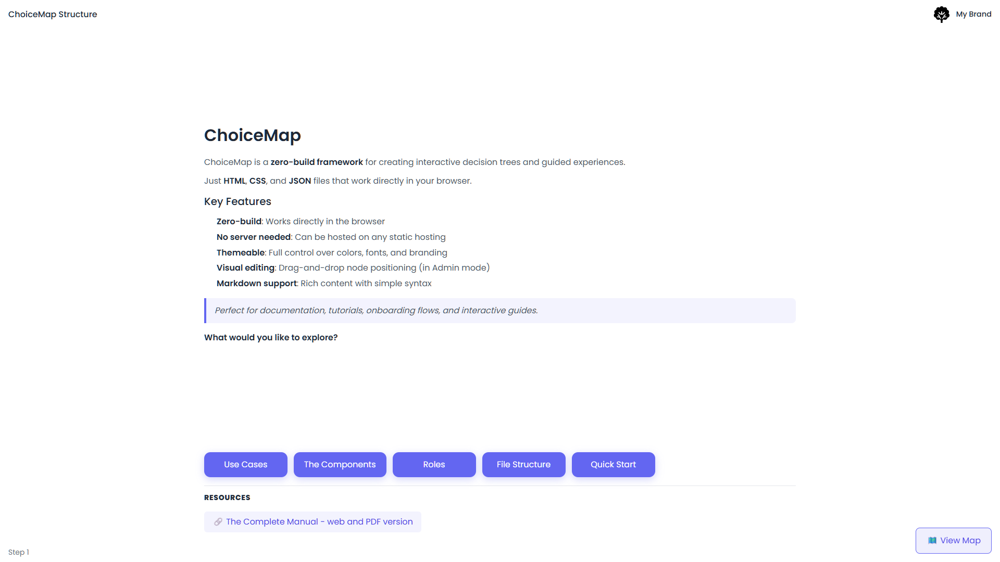
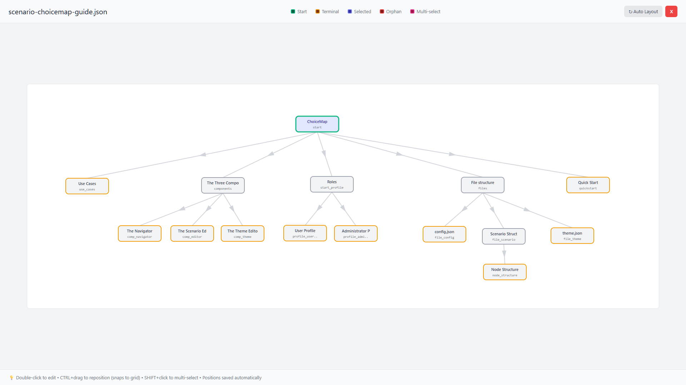

# ChoiceMap

**Version 2.0 — February 2025**

**A framework for documenting multiple-choice processes.**

ChoiceMap transforms complex workflows into interactive experiences. Instead of reading a document from start to finish, users navigate through a decision tree where each choice opens a different path. Perfect for process documentation, corporate training, troubleshooting guides, compliance flows, and interactive storytelling.

👉 **[Try the live demo](https://paolodalprato.github.io/ChoiceMap/navigator.html)** — The demo is a ChoiceMap scenario that explains ChoiceMap itself: an interactive guide to the framework's architecture, tools, and workflow.

### Screenshots

**Navigator** (User View)

[](docs/img/navigator-interface.png)
*The card view with content, choices, and resources*

**Scenario Editor** (Admin View)

[](docs/img/scenario-editor-map.png)
*The visual map for managing scenario structure*

## 📥 Installation

Choose a folder on your computer where you want to install ChoiceMap (e.g., `C:\Projects`, `~/Sites`, or any directory you prefer). All project files will be placed there.

### Option A: Git Clone

**Prerequisites**: [Git](https://git-scm.com/) must be installed.

```bash
cd /path/to/your/folder
git clone https://github.com/paolodalprato/ChoiceMap.git
cd ChoiceMap
```

### Option B: Download ZIP

1. Go to [github.com/paolodalprato/ChoiceMap](https://github.com/paolodalprato/ChoiceMap)
2. Click the green **Code** button, then **Download ZIP**
3. Extract the ZIP into your chosen folder

Both methods produce the same result. Then start a local server (see [Quick Start](#-quick-start) below).

## ✨ Features

- **Interactive Decision Trees**: Create multi-path narratives where user choices shape the journey
- **Visual Journey Map**: Real-time tree visualization showing current position and visited paths
- **Semantic Loop Coloring**: Connection colors based on logical hierarchy, not visual position — loops stay orange even after repositioning nodes
- **Manual Level Override**: Set explicit levels for nodes to control hierarchy and ensure correct loop detection in complex scenarios
- **Snap-to-Grid Positioning**: Node positions snap to a 20px grid for clean, aligned layouts (Scenario Editor)
- **Multi-Select and Alignment**: Select multiple nodes with SHIFT+click, align horizontally/vertically, distribute evenly (Scenario Editor)
- **Simple JSON Format**: Plain strings for all content, no complex structures
- **JSON-Based Content**: Easy-to-edit scenario files, no coding required for content changes
- **Visual Scenario Editor**: Dedicated tool for creating and managing scenarios
- **Visual Theme Editor**: Customize colors, branding, and fonts with live preview
- **Company Branding**: Add logo, company name, and website link
- **Google Fonts Support**: Choose from 9 font families including Inter, Roboto, Poppins
- **Resource Attachments**: Add downloads, links, and videos to any node
- **Progress Tracking**: Visual indicators for visited paths and current step
- **Choice Reordering**: Move choices up/down with arrow buttons in the editor — no need to delete and recreate
- **Backtracking**: Users can navigate back through their journey (via buttons; map jumps reset the path)
- **No Build Process**: Single HTML files, works directly in browsers
- **Fully Responsive**: Works on desktop and mobile devices

## 🎯 Use Cases

- **Corporate Training**: Onboarding flows, compliance training, process walkthroughs
- **Education**: Interactive lessons, decision-making exercises, case studies
- **Product Tours**: Feature exploration, user onboarding
- **Interactive Stories**: Choose-your-own-adventure narratives
- **Process Documentation**: Visual workflow exploration

## 📁 Project Structure

```
ChoiceMap/
├── config.json                      # Configuration (scenario + theme files)
├── defaults.json                    # Shared defaults (fonts, theme fallbacks, layout)
├── navigator.html                   # Main navigator engine
├── scenario-editor.html             # Visual editor for creating scenarios
├── theme-editor.html                # Visual editor for customizing themes
├── shared-utils.js                  # Shared utilities (sanitization, node calculations, SVG helpers, ErrorBoundary)
├── shared-styles.css                # Common styles shared across the editor interfaces
├── scenario-choicemap-guide.json    # Default: interactive guide to ChoiceMap itself
├── scenario-quiz.json               # Example: quiz with correct/wrong feedback
├── scenario-workflow.json           # Example: customer support escalation
├── scenario-sample.json             # Template: narrative with multiple paths
├── theme_choicemap.json             # Theme for the ChoiceMap guide scenario
├── theme.json                       # Theme configuration (colors, branding)
├── start-navigator.bat              # Quick start for navigator (Windows)
├── start-scenario-editor.bat        # Quick start for scenario editor (Windows)
├── start-theme-editor.bat           # Quick start for theme editor (Windows)
├── README.md                        # This file
├── LICENSE                          # MIT License
└── docs/                            # Folder for downloadable resources
    └── (your PDF, DOC files)
```

## 🚀 Quick Start

### Option 1: Using Start Scripts (Windows only)

- Double-click `start-navigator.bat` to run the navigator
- Double-click `start-scenario-editor.bat` to run the scenario editor
- Double-click `start-theme-editor.bat` to run the theme editor

> **Note for Mac/Linux users**: The `.bat` files are Windows-only. Use Option 2 (manual start) instead — it works on all operating systems.

### Option 2: Manual Start (All platforms)

1. Open a terminal in the project folder
2. Start a local server:
   ```bash
   python -m http.server 8000
   ```
   On some systems you may need `python3` instead of `python`.
3. Open in your browser:
   - Navigator: `http://localhost:8000/navigator.html`
   - Editor: `http://localhost:8000/scenario-editor.html`

### Option 3: Deploy to Web Server

Upload all files to any web server or static hosting (GitHub Pages, Netlify, Vercel).

> ⚠️ **Important**: The navigator requires a web server due to JSON loading. It won't work by opening the HTML file directly (`file://` protocol).

## ⚙️ Configuration

The `config.json` file controls which scenario and theme to load:

```json
{
    "scenario": "scenario-choicemap-guide.json",
    "theme": "theme_choicemap.json",
    "showCredits": true
}
```

| Field | Description |
|-------|-------------|
| `scenario` | JSON file containing the scenario data |
| `theme` | JSON file containing theme/branding (optional, defaults to `theme.json`) |
| `showCredits` | Show author credits footer (optional, defaults to `true`) |

To switch scenarios or themes, change the values and refresh.

## 🎨 Using the Scenario Editor

The visual editor makes it easy to create and modify scenarios without editing JSON manually.

### Accessing the Editor

```
http://localhost:8000/scenario-editor.html
```

### Editor Features

- **Auto-Load**: On startup, automatically loads the scenario specified in `config.json`
- **Node List View**: See all nodes with their level and status (START, END, orphan)
- **Collapsible Sidebar**: Hide the node list to maximize editing space
- **Visual Map View**: Interactive tree visualization of your scenario
- **Manual Level Override**: Set explicit levels for nodes to control hierarchy and map positioning
- **Snap-to-Grid**: Node positions automatically snap to a 20px grid when dragging (CTRL+drag)
- **Multi-Select**: SHIFT+click to select multiple nodes for batch operations
- **Alignment Tools**: Align selected nodes horizontally or vertically with one click
- **Distribution Tools**: Distribute 3+ selected nodes with equal spacing
- **Select Level**: Quickly select all nodes at the same hierarchical level
- **Inline Node Creation**: Create new nodes directly from the choice dropdown
- **Choice Text Validation**: The editor requires button text when creating nodes (prevents invisible choices)
- **Node Creation Validation**: Both Node ID and Node content are required when creating new nodes (prevents incomplete nodes)
- **Self-Reference Prevention**: Nodes cannot connect to themselves in the Target Node dropdown (prevents circular loops)
- **Duplicate Target Prevention**: Nodes already linked by other choices are hidden from the target list
- **Resizable Content Editor**: Drag the orange handle to expand the content textarea
- **Live Preview**: Test your scenario directly from the editor
- **Choice Reordering**: Reorder choices with ▲/▼ buttons — no need to delete and recreate them
- **Resource Management**: Add downloads, links, and videos to any node

### Workflow

1. Start the local server and open the editor (it auto-loads the scenario from `config.json`)
2. Or click **New** for a blank scenario, or **Open** to load a different JSON file
3. Click **Settings** to define scenario metadata (title, description, author)
4. Select a node from the sidebar to edit it
5. Add choices with **+ Add Choice** — reorder them with the ▲/▼ buttons
6. Enter the **Button Text** first, then select a target node or use **+ Create new node...** to create a child node
7. Click **Save** to download the updated JSON
8. Copy the saved file to the project folder, replacing the old version
9. Hard refresh (Ctrl+Shift+R) the navigator to see changes

> 💡 **Tip**: When creating a new node, enter the button text first. The popup only asks for Node ID and content — the button text is already set.

### ⚠️ Important: Node Deletion

When deleting a node that has child nodes connected to it:

- The child nodes become **orphans** (disconnected from the tree)
- They remain visible in the editor but **invisible in the navigator**
- They appear in the Map view with a red border and "orphan" badge

**Best practice**: Delete nodes from the leaves (end nodes) upward, or manually reconnect orphaned nodes to other parent nodes before saving.

### Map View and Connection Colors

The Map view displays your scenario as a visual tree. Connection colors indicate the logical relationship between nodes:

| Color | Meaning |
|-------|---------|
| **Gray** | Forward connection (to a descendant node) |
| **Orange** | Loop connection (to an ancestor node) |
| **Purple** | Same-level connection (to a sibling node) |

Colors are based on **logical hierarchy** (node levels), not visual position. This means loops stay orange even if you reposition nodes with CTRL+drag.

The map canvas (white area) is **dynamic**: it automatically expands when you drag nodes beyond its right or bottom edges. This allows scenarios of any size without fixed boundaries.

### Node Positioning Tools

The Scenario Editor provides several tools for precise node positioning:

| Tool | How to use | Description |
|------|------------|-------------|
| **CTRL+drag** | Hold CTRL and drag a node | Reposition with snap-to-grid (20px) |
| **SHIFT+click** | Hold SHIFT and click nodes | Add/remove nodes from multi-selection |
| **Select Level** | Click button in toolbar | Select all nodes at the same level as current node |
| **Align H** | Select 2+ nodes, click button | Align nodes horizontally (same Y coordinate) |
| **Align V** | Select 2+ nodes, click button | Align nodes vertically (same X coordinate) |
| **Distrib H** | Select 3+ nodes, click button | Distribute nodes with equal horizontal spacing |
| **Distrib V** | Select 3+ nodes, click button | Distribute nodes with equal vertical spacing |
| **Auto Layout** | Click button | Reset all nodes to automatic positioning |

Multi-selected nodes display a pink border. The selection count appears in the toolbar when nodes are selected.

### Manual Level Override

By default, node levels are calculated automatically based on the shortest path from the start node. However, in complex scenarios with multiple paths to the same node, you may need to set levels explicitly.

In the Node Editor, the **Level** section shows:
- **Auto-calculated level**: the default BFS-computed level
- **Override Level field**: set an explicit level to control hierarchy

Use cases for manual level override:
- Ensure correct loop coloring when automatic calculation doesn't reflect the logical structure
- Control vertical positioning in the map view
- Define semantic hierarchy independent of connection paths

## 🎨 Using the Theme Editor

The theme editor allows you to customize the navigator's appearance with your company branding.

### Accessing the Theme Editor

```
http://localhost:8000/theme-editor.html
```

### Theme Editor Features

- **Live Preview**: See changes in real-time as you edit
- **Company Branding**: Add logo, company name, and website URL
- **Brand Display**: Logo and company name appear in the header (top right)
- **Color Customization**: Customize all colors (background, text, buttons including Back button, map nodes)
- **Font Selection**: Choose from 9 font families (System Default + 8 Google Fonts)
- **Import/Export**: Load and save theme files

### Available Fonts

| Key | Font |
|-----|------|
| `system` | System Default (no external load) |
| `inter` | Inter |
| `roboto` | Roboto |
| `open-sans` | Open Sans |
| `lato` | Lato |
| `montserrat` | Montserrat |
| `poppins` | Poppins |
| `source-sans` | Source Sans 3 |
| `nunito` | Nunito |

### Theme File Structure

```json
{
    "brand": {
        "name": "Your Company",
        "logo": "https://example.com/logo.png",
        "website": "https://example.com"
    },
    "typography": {
        "fontFamily": "inter"
    },
    "colors": {
        "background": "#ffffff",
        "text": "#1f2937",
        "accent": "#6366f1"
    },
    "buttons": {
        "choiceBackground": "#6366f1",
        "visitedBackground": "#10b981",
        "backBackground": "#f97316",
        "backText": "#ffffff"
    },
    "map": {
        "nodeCurrent": "#6366f1",
        "nodeVisited": "#3730a3"
    }
}
```

All values are optional. Missing values use defaults from `defaults.json`.

### Multiple Themes

Create multiple theme files for different clients or contexts:

```
├── theme-corporate.json
├── theme-training.json
├── theme-dark.json
```

Switch between them by changing the `theme` value in `config.json`.

## 📝 JSON Structure

The scenario is defined in a simple JSON format with plain strings:

```json
{
    "meta": {
        "title": "Scenario Title",
        "description": "Description of the scenario",
        "author": "Author Name"
    },
    "translations": {
        "step": "Step",
        "restart": "Start Over",
        "endOfPath": "End of this path",
        "resources": "Resources",
        "viewMap": "View Map",
        "mapOf": "Map of",
        "back": "Back",
        "download": "Download",
        "openLink": "Open",
        "watchVideo": "Watch"
    },
    "startNode": "start",
    "nodes": {
        "start": {
            "content": "# Welcome\n\nThis is **markdown** content.",
            "level": 1,
            "position": { "x": 0, "y": 0 },
            "choices": [
                { "text": "Option A", "next": "node_a" },
                { "text": "Option B", "next": "node_b" }
            ],
            "resources": []
        }
    }
}
```

> ⚠️ **Required**: The `translations` section is mandatory. Without it, navigation buttons will have no text.

### Node Fields

| Field | Description |
|-------|-------------|
| `content` | Markdown content displayed in the node |
| `level` | Hierarchical level for map positioning and loop detection (auto-calculated if omitted) |
| `position` | Map coordinates `{ x, y }` — placeholder `{ x: 0, y: 0 }` triggers auto-layout on save |
| `choices` | Array of choices leading to other nodes |
| `resources` | Array of attached resources (links, downloads, videos) |

### Supported Markdown

- `# Heading 1` and `## Heading 2`
- `**bold**` and `*italic*`
- `- list items`
- `> blockquotes`

### Resource Types

| Type | Description | Icon |
|------|-------------|------|
| `download` | Downloadable file (PDF, DOC, etc.) | 📥 |
| `link` | External URL (opens in new tab) | 🔗 |
| `video` | Video link | 🎬 |

### Local Resources

You can use relative URLs for local files (logos, PDFs, attachments) instead of external URLs. This works both during local development and after deployment.

**Recommended structure:**

```
your-project/
├── navigator.html
├── config.json
├── scenario.json
├── theme.json
└── docs/                    # Local resources folder
    ├── company-logo.png
    ├── user-guide.pdf
    └── intro-video.mp4
```

**Usage in theme.json:**

```json
{
    "brand": {
        "logo": "docs/company-logo.png"
    }
}
```

**Usage in scenario resources:**

```json
{
    "resources": [
        {
            "type": "download",
            "label": "User Guide",
            "url": "docs/user-guide.pdf"
        }
    ]
}
```

When deploying to a web server, upload the `docs/` folder along with the other files. The relative paths will work identically.

## 🌐 Deployment

### GitHub Pages

1. Push your files to a GitHub repository
2. Go to Settings → Pages
3. Select "Deploy from a branch" and choose `main`
4. Your navigator will be available at `https://username.github.io/repo-name/navigator.html`

### Multiple Instances

For multiple training modules, create separate folders with independent config files:

```
/training-portal/
├── onboarding/
│   ├── config.json
│   ├── navigator.html
│   └── scenario-onboarding.json
├── compliance/
│   ├── config.json
│   ├── navigator.html
│   └── scenario-compliance.json
```

### Embedding via iframe

```html
<iframe 
    src="https://your-domain.com/navigator.html" 
    width="100%" 
    height="600" 
    frameborder="0">
</iframe>
```

## 🔄 ChoiceMap on ChoiceMap

The default scenario (`scenario-choicemap-guide.json`) is a self-describing interactive guide: a ChoiceMap scenario that explains ChoiceMap itself. It walks users through the framework's architecture, tools, file structure, and workflow using the same decision-tree format that ChoiceMap provides.

This serves two purposes:
- **Documentation**: an interactive alternative to reading the README linearly
- **Live example**: a real-world scenario demonstrating features like multi-path navigation, resources, loop handling, and theming

The [live demo](https://paolodalprato.github.io/ChoiceMap/navigator.html) runs this scenario with a dedicated theme (`theme_choicemap.json`).

## 📋 Technical Details

- **Framework**: React 18 (via CDN)
- **Styling**: Tailwind CSS + custom CSS
- **No build process**: Everything runs directly in the browser
- **Dependencies**: None (all loaded via CDN)

### Browser Compatibility

Chrome, Firefox, Safari, Edge (all modern versions)

## 📄 License

MIT License - see [LICENSE](LICENSE) file for details.

## 📖 Documentation

For a comprehensive guide with screenshots and detailed tutorials, see the **[ChoiceMap Manual](https://docs.ai-know.pro/choicemap-en/)** (also available in [Italian](https://docs.ai-know.pro/choicemap/)).

## 👤 Author

**Paolo Dalprato**
- Website: [ai-know.pro](https://ai-know.pro)
- Substack: [paolodalprato.substack.com](https://paolodalprato.substack.com)
